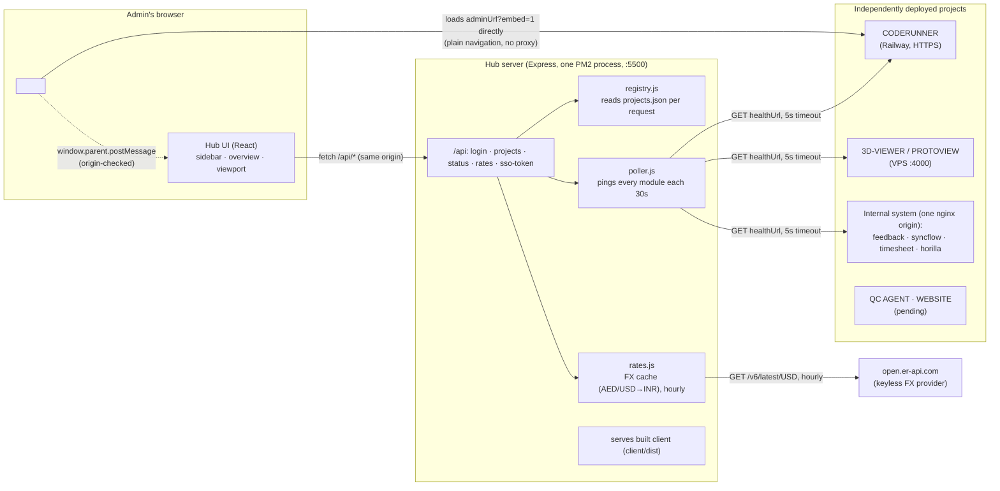
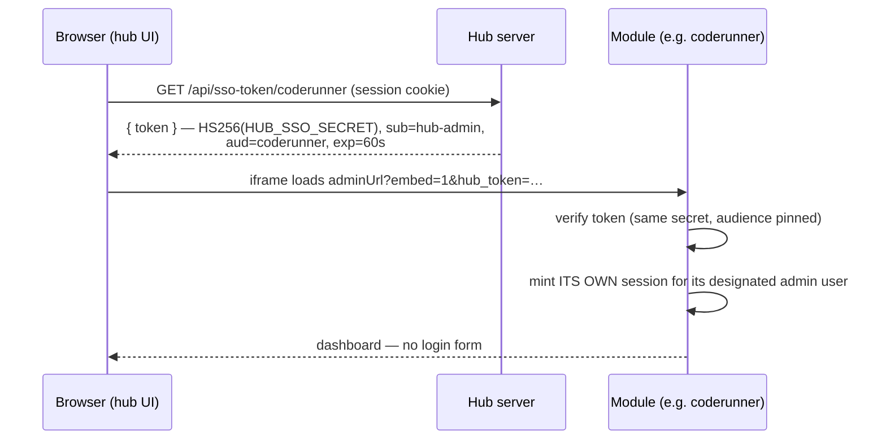

# ADMIN-LINK — Architecture

ADMIN-LINK is LOF's central admin hub: one password-gated portal that shows every
LOF project in a sidebar, displays each project's **existing admin page live
inside the hub** (iframe), and watches every project's health with a status dot.
Nothing is rebuilt — projects keep their own admin UIs, deployments, and logins;
the hub *maps* them into one place.

> Design history and decisions: `docs/superpowers/specs/2026-06-10-admin-link-hub-design.md`
> Per-module integration guides: `docs/integration/` · Feature backlog: `docs/BACKLOG.md`

---

## 1. The big picture



Three load-bearing properties:

1. **The browser only ever XHRs the hub** (same origin → zero CORS anywhere).
2. **Iframes load modules directly** — page navigation, not API calls, so modules
   need no hub-specific networking. The hub is not a proxy; if the hub dies,
   modules are untouched.
3. **The hub server is the only thing that pings modules** (health), so module
   firewalls only ever see one watcher.

---

## 2. Repository layout

```
ADMIN-LINK/
├─ projects.json          ← THE registry: one entry per module (deploy-time config, hot-reloaded)
├─ .env                   ← PORT, ADMIN_PASSWORD, SESSION_SECRET, HUB_SSO_SECRET (gitignored)
├─ ecosystem.config.js    ← PM2: single process "admin-link"
├─ DEPLOY.md              ← VPS install/update runbook
├─ server/                ← Express backend (CommonJS, Node 18+)
│  ├─ index.js            ← entrypoint: env, wiring, listen 0.0.0.0:PORT
│  ├─ app.js              ← createApp(): routes + static client + SPA fallback
│  ├─ auth.js             ← single-password login → JWT httpOnly cookie (12h)
│  ├─ registry.js         ← projects.json loader with last-good fallback
│  ├─ poller.js           ← 30s health checks, 5s timeout, in-memory status cache
│  ├─ rates.js            ← hourly FX fetch (AED→INR, USD→INR), last-good cache
│  └─ tests/              ← Vitest + Supertest (auth, registry, poller, rates, api, sso)
├─ client/                ← Vite + React 18 frontend
│  └─ src/
│     ├─ App.jsx          ← session gate: boot → Login | Dashboard
│     ├─ api.js           ← thin fetch helpers for /api/*
│     ├─ styles.css       ← ALL theming (LOF style gate via CSS variables)
│     ├─ components/      ← Login · Dashboard · Topbar · Sidebar · Overview · Viewport · Toast
│     └─ hooks/useHubMessages.js  ← postMessage listener (origin allowlist)
└─ docs/
   ├─ superpowers/        ← design spec + implementation plan (how this was built)
   ├─ integration/        ← paste-ready briefs for each module's own repo/session
   └─ BACKLOG.md          ← tiered roadmap (stats-on-cards, alerts, morning brief…)
```

**No database.** All state is `projects.json` (on disk) + the poller's in-memory
cache. This is deliberate: the hub must be the most boring, least-breakable
service in the fleet.

---

## 3. The registry — how a project becomes a module

`projects.json` is the single source of truth. One entry per module:

```jsonc
{
  "id": "coderunner",          // permanent internal id — also the SSO token audience
  "name": "CODERUNNER",        // sidebar/card display name
  "description": "Python compiler & missions for students",
  "adminUrl": "https://code-runner-production.up.railway.app/oversight/dashboard",
  "healthUrl": "https://code-runner-production.up.railway.app/api/health",
  "accent": "#76B900",         // module color (active bar, card chip)
  "sso": true                  // hub appends a signed hub_token to the frame URL
}
```

- `adminUrl`/`healthUrl`/`sso` are **optional**. No `adminUrl` ⇒ the module shows
  as a dashed **NOT CONNECTED** placeholder card until its address arrives.
- The server **re-reads the file on every request** — adding/editing a module is
  an edit + browser refresh. No rebuild, no restart.
- A broken edit (invalid JSON / missing id/name) never takes the hub down: the
  registry keeps serving the **last good list** and logs the error.
- **There is deliberately NO UI or API to add/edit modules.** Module management
  is file-only, owner-only, by requirement.

### The module contract (what each project promises)

| # | Promise | Why |
|---|---------|-----|
| 1 | Don't block framing — no `X-Frame-Options`, no restrictive `frame-ancestors` | Otherwise the hub's iframe renders blank |
| 2 | Embed mode: hide own global chrome when `?embed=1` / `window.self !== window.top` | Avoids nav-inside-nav |
| 3 | A no-auth GET (healthUrl) returning 2xx | Powers the status dot; falls back to adminUrl |
| 4 | *(optional)* `postMessage({type:'notify', text}, HUB_ORIGIN)` | Module-initiated toasts in the hub |
| 5 | *(optional, sso)* verify `hub_token` and mint own session | One-login experience (see §6) |

---

## 4. Server internals

Every piece is a small factory function wired together in `index.js` — each is
independently testable with fakes (see `server/tests/api.test.js`).

| Module | Job | Key decisions |
|---|---|---|
| `auth.js` | `POST /api/login` checks `ADMIN_PASSWORD` (constant-time hash compare), sets `admlink_session` — an **httpOnly, SameSite=Lax JWT cookie, 12h** | No user table; one shared admin password by design. `requireAuth` guards every data route |
| `registry.js` | `load()` → parse + validate `projects.json` | Last-good fallback; validation requires `id` + `name`, everything else optional |
| `poller.js` | `start()` checks all modules every **30s** in parallel, **5s abort-timeout** each | Status model in §5; uses healthUrl, falls back to adminUrl; pure in-memory cache served by `GET /api/status` |
| `rates.js` | Fetches USD-based FX **hourly** from `open.er-api.com` (keyless), caches `usdInr` + derived `aedInr` | Company is Dubai-based with an Indian team → topbar shows AED→INR and USD→INR; failures keep last-good rates; provider updates daily so hourly is plenty |
| `app.js` | Routes + serves `client/dist` with SPA fallback | Also mints SSO tokens: `GET /api/sso-token/:projectId` (§6) |

API surface (all JSON, all auth-gated except login):

```
POST /api/login {password}     → sets session cookie
POST /api/logout               → clears cookie
GET  /api/me                   → 200 if session valid (client boot check)
GET  /api/projects             → registry array (hot from disk)
GET  /api/status               → { [id]: {status, httpStatus, latencyMs, lastChecked} }
GET  /api/rates                → { rates: {usdInr, aedInr, fetchedAt} | null }
GET  /api/sso-token/:projectId → { token } (60s JWT, only for sso:true modules)
```

---

## 5. Status model

```
poller result            status      dot
──────────────────────   ─────────   ──────────────────────────────
HTTP < 500               online      ● green, pulsing + latency ms
HTTP ≥ 500               error       ● amber
timeout / conn refused   down        ○ hollow gray ring
no URL configured        pending     ◌ dashed gray (placeholder)
not yet polled           (absent)    faded dot, "CHECKING…"
```

“4xx = online” is intentional: a 401/404 means the server *answered* — the
service is up even if that path wants auth. The frontend re-fetches
`/api/status` every 30s **without reloading iframes** (statuses and frame state
are independent).

---

## 6. Auth & SSO

Two layers, deliberately separate:

1. **Hub login** — one admin password → JWT cookie. Gates the portal itself.
2. **Module logins** — each framed admin page keeps its own auth. Default
   experience: log in once inside the frame; module sessions persist in the
   browser.

**SSO (phase 2, hub side live):** for modules flagged `"sso": true`, the hub
removes the second login without ever storing module passwords:



Properties: tokens are minted per frame-mount, die in 60 seconds, and are scoped
to one module (`aud`). The module stays sovereign — it decides what a hub token
is worth and issues its own session. A failed/missing token degrades gracefully
to the module's normal login. Cross-origin cookies are never involved (the fleet
is IP/mixed-domain, so a parent-domain cookie was never an option).

Secret distribution: one `HUB_SSO_SECRET` value, set in the hub's env and in the
env of each sso-enabled module's verifying service. Rotation = change everywhere,
restart.

---

## 7. Client internals

```
App (session gate: /api/me on boot)
├─ Login                      one password field → /api/login
└─ Dashboard                  owns all data state
   ├─ Sidebar                 Overview item + per-module rows (dot, latency, accent bar)
   ├─ Topbar                  date + FX chips (1 AED / 1 USD → ₹), /api/rates hourly;
   │                          chips simply don't render until rates arrive
   ├─ Overview                default view: card grid, "N of M online" summary
   ├─ Viewport                selected module: toolbar (↻ reload, ↗ new tab) + iframe
   │                          · pending → "not connected yet" panel
   │                          · down    → "not responding" panel (retry / new tab)
   │                          · sso     → fetches hub_token before mounting frame
   └─ Toast(s)                module postMessage notifications (5s auto-dismiss)
```

- `Dashboard` fetches `/api/projects` once and `/api/status` every 30s; selection
  state decides Overview vs Viewport. No router — one screen, two views.
- `useHubMessages` listens for `window.message` events and **only accepts origins
  derived from registry adminUrls** — anything else is dropped silently.
- Iframe reload = React `key` bump (also re-mints the SSO token).

**Styling:** `styles.css` holds the complete LOF style gate — white surfaces,
2px `#e5e7eb` borders, LOF blue `#1C4D8C` (10% fill / 20% ring chips), Orbitron
(headings, uppercase) / Rajdhani (body) / Fira Code (data), 256px white sidebar,
radius-16 cards with blue glow hover. Every visual constant is a CSS variable at
the top of the file — **reskinning the hub = editing that variable block, nothing
else.** Each module's `accent` colors its own active bar and chip, so modules
keep their identity inside one product family.

---

## 8. Deployment topology

```
VPS (one box)
├─ pm2: admin-link  → node server/index.js  → 0.0.0.0:5500
│   └─ serves client/dist (built once at deploy)
├─ (optional) nginx :80 → 127.0.0.1:5500     docs/nginx-admin-link.conf
└─ projects.json + .env                       edited in place; registry hot-reloads
```

- Runbook: `DEPLOY.md` (install → build client → pm2 start; update = pull,
  install, build, restart).
- The hub serves plain HTTP on an IP. Framing HTTPS modules (Railway) inside an
  HTTP page is allowed by browsers; the reverse would not be. If the hub ever
  gets HTTPS, set the cookie `secure` flag in `server/auth.js`.
- **Never** put `X-Frame-Options` on the hub's own nginx — the hub frames others.

Current module endpoints (placeholders until each host is known):

| Module | Where it runs | Status |
|---|---|---|
| CODERUNNER | web on Railway (`code-runner-production.up.railway.app`), API+runner on VPS | 🟢 connected, sso minting |
| 3D-VIEWER (PROTOVIEW) | VPS `:4000` (Express serves built client) | mapped, awaiting VPS IP |
| STUDENT-FEEDBACK / SYNC FLOW / TIMESHEET / HORILLA | INTERNAL-AGENTICSYSTEM — one docker/nginx origin (`/feedback` `/syncflow` `/timesheet` `/hr/`) | mapped, awaiting host |
| QC AGENT | standalone FastAPI+React, heading to VPS | awaiting serving decision |
| SOCIAL PULSE | social-media agents (project starting) | placeholder, awaiting build |
| TECH RADAR | global tech-news briefing (`docs/integration/TECH-RADAR-CONCEPT.md`) | placeholder, awaiting build |
| NORTH STAR / LEDGER / STUDENT 360 / BOARDROOM / PAPER TRAIL | CEO command-center set (`docs/integration/CEO-MODULES.md`) | placeholders, awaiting build |
| WEBSITE | unknown | awaiting details |

---

## 9. Testing

- **Server** (`npm --prefix server test`): Vitest + Supertest — auth flows,
  registry fallback, poller states (online/error/down/pending/timeout), FX rates
  caching, every API route incl. SSO minting/authz. All HTTP is tested through
  `createApp()` with fakes; no network.
- **Client** (`npm --prefix client test`): Vitest + Testing Library (jsdom) —
  login, sidebar dots/selection, overview cards/summary/clicks, topbar FX chips,
  viewport frame URL building (embed + sso token + fallbacks), postMessage
  origin filtering.
- Built TDD; 66 tests. End-to-end smoke: Playwright (`channel: 'msedge'`)
  driving the real served app — login → overview → module frames.

## 10. Decision log (the "why"s)

| Decision | Why |
|---|---|
| iframe embed, not Next.js multi-zones / module federation | Stack-agnostic (Django, FastAPI, Vite, Next all framed alike); zero coupling; adding a module = one JSON entry |
| No database | Registry is config, statuses are ephemeral; nothing worth operating a DB for |
| File-only module management (no admin UI for it) | Owner requirement: dashboard admins must not add/remove modules |
| Hub never proxies module traffic | Hub outage can't take modules down; no bandwidth/latency tax |
| SSO via short-lived signed token, not shared cookies | No common parent domain (IP + railway.app mix); modules keep auth sovereignty |
| Health = "did the server answer", not "was it 200" | Auth-gated pages legitimately 401/302; only 5xx/timeouts are real trouble |
```
